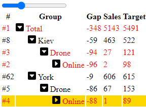

# @gramex/insighttree

Insight Tree breaks down a metric into a hierarchy (tree) and highlights the insights from that metric.

## Example

When a metric (e.g. **sales**) fails to meet its target, it's important to understand why.

Usually, we start by looking for the biggest gap. Which **city**? Which **product**? Which **channel**? Where is the largest gap?

But under-performance in one city may be **offset** by a over-performance in another city.
So we need to drill down to the next level. And the next.

**Insight Tree** automates this drill-down. It combs the hierarchy to highlight the most **surprising impact**.

Here's a sample output:

[](docs/sales.html ":include :type=html")

## Installation

Install via `npm`:

```bash
npm install @gramex/insighttree@3
```

Use locally as an ES module:

```html
<link rel="stylesheet" href="./node_modules/@gramex/insighttree/dist/insighttree.css" />
<script type="module">
  import { insightTree } from "./node_modules/@gramex/insighttree/dist/insighttree.js";
</script>
```

Use locally as a script:

```html
<link rel="stylesheet" href="./node_modules/@gramex/insighttree/dist/insighttree.css" />
<script src="./node_modules/@gramex/insighttree/dist/insighttree.min.js"></script>
<script>
  gramex.insightTree(...)
</script>
```

Use via CDN as an ES Module:

```html
<link rel="stylesheet" href="https://cdn.jsdelivr.net/npm/@gramex/insighttree@3/dist/insighttree.css" />
<script type="module">
  import { insightTree } from "https://cdn.jsdelivr.net/npm/@gramex/insighttree@3/dist/insighttree.js";
</script>
```

Use via CDN as a script:

```html
<link rel="stylesheet" href="https://cdn.jsdelivr.net/npm/@gramex/insighttree@3/dist/insighttree.css" />
<script src="https://cdn.jsdelivr.net/npm/@gramex/insighttree@3/dist/insighttree.min.js"></script>
<script>
  gramex.insightTree(...)
</script>
```

## Data structure

`insightTree()` needs an array of objects with at least 1 variable to group by
(e.g. `country`, `product`, `channel`) and at least 1 metric to sum (e.g. `sales`, `target`).
For example:

[sales-data.json](docs/sales-data.json ":ignore")

| city | product | channel | sales | target | gap |
| ---- | ------- | ------- | ----: | -----: | --: |
| Aden | Clock   | Online  |    61 |     76 | -15 |
| Aden | Clock   | Retail  |    66 |     83 | -17 |
| Aden | Drone   | Online  |    33 |     52 | -19 |
| Aden | Drone   | Retail  |   105 |     90 |  15 |
| ...  | ...     | ...     |   ... |    ... | ... |

## Create an insight tree from data

To create a basic insight tree with this data, construct the `insightTree()` as follows:

[Source code](docs/sales-tutorial-1.html ":include :type=code")

Output:

[[Tutorial - 1](docs/sales-tutorial-1.png)](docs/sales-tutorial-1.html ":include :type=html height=200px")

This tree explores the City > Product > Channel hierarchy for the biggest insight, based on:

1. Impact: As defined by the `sales - target` gap
2. Surprise: How "hidden" is it below a low impact

It shows the insight rank of each node. `#1` has the highest impact x surprise. `#2` is the next, and so on.

Click any row to expand or collapse it

## Tree data structure

`insightTree()` returns an object with a `.data` property.
This is an array of objects, one for each row of the tree to render. The object keys are:

- All groups, e.g. `city`, `product`, `channel`
- All metrics, e.g. `sales`, `target`
- Additional Symbol keys that you can `import { CHILDREN, DESCENDANT_COUNT, GROUP, IMPACT, LEVEL, RANK, SURPRISE } from ...`
  - `[CHILDREN]`: array of child nodes
  - `[DESCENDANT_COUNT]`: number of descendants
  - `[GROUP]`: current group value. For `row[LEVEL] == 1`, this is the `city`, for `row[LEVEL] == 2`, this is the `product`, etc.
  - `[IMPACT]`: normalized value of the `impact` metric. 1 indicates the highest value, 0 indicates the lowest value.
  - `[LEVEL]`: level of indentation
  - `[RANK]`: rank of the insight (`row[SURPRISE] * row[IMPACT]`). The highest ranked insight is the most surprising and impactful.
  - `[SURPRISE]`: how surprising is the value of this node (0-100%). 0% indicates you would have found this node immediately traversing by rank. 100% indicates it is the last node you would have found.

## Expand or collapse levels

Call `tree.update({ level: 1 })` to show the level 0 (root node) and level 1 (children of root node):

[](docs/sales-tutorial-1a.html ":include :type=html height=200px")

Move the slider to show more or fewer levels.

[Source code](docs/sales-tutorial-1a.html ":include :type=code")

## Expand or collapse insights

Call `tree.update({ rank: 4 })` to show the top 4 insights.

[](docs/sales-tutorial-2.html ":include :type=html height=200px")

This tree:

- **Controls the number of insights**. Increasing the slider shows more gaps. Decreasing shows fewer gaps.
- **Highlights the current gap**. The row in orange is the current insight.

[Source code](docs/sales-tutorial-2.html ":include :type=code")

## Expand or collapse deep insights

Call `tree.updateLeaf(1)` to show first top "deep" insight (i.e. at the deepest segment -- a leaf node).

[](docs/sales-tutorial-2c.html ":include :type=html height=380px")

Move the slider to show the next or previous deep insight - highlighted in orange.

## Expand or collapse nodes

Call `tree.toggle(node, true)` to expand a specific node. `.toggle(node, false)` collapses it. `.toggle(node)` toggles it.

[](docs/sales-tutorial-2a.html ":include :type=html height=200px")

[Source code](docs/sales-tutorial-2a.html ":include :type=code")

## Expand or collapse the tree

Call `tree.show((row, node) => ...)` to expand or collapse each node in the tree based on a rule.

It accepts a function that returns `true` to expand the node, `false` to collapse it. It takes 2 parameters:

1. `row`: an object containing all group keys and metrics for the row
2. `node`: the DOM node for the row

For example, `tree.show((row) => row[LEVEL] == 0 || row[GROUP] == 'Bonn')` to expand all rows of level 0, and any row with the group "Bonn".

[](docs/sales-tutorial-2b.html ":include :type=html height=200px")

[Source code](docs/sales-tutorial-2b.html ":include :type=code")

## Style the tree

[`insightTree()`](#api) adds classes and attributes to each row. A may have these classes:

- `.insight-current` on current ranked insight. Default style: `background-color: ##ffc107`. Set to `background-color: gold` to color it gold.
- `.insight-highlight` on higher ranked insights. Default style: `font-weight: bold`. Set to `font-weight: normal; color: red` to color it red.
- `.insight-hidden` on lower ranked insights. Default style: `display: none`. Set to `display: block; color: lightgrey` to show them in gray.
- `.insight-closed` on collapsed insights. Any child `.insight-toggle` is styled as
  - `.insight-toggle:before { content: "▶"; }` when expanded
  - This is rotated 90 degrees clockwise when collapsed (like ▼)

A row always has these attributes:

- `[data-insight-level]`: level of indentation. Default style: `cursor: pointer`
- `[data-insight-rank]`: rank of the insight. `1` is the highest ranked insight. No default style.

Note: You can rename the "Total" group to "All" by passing `insightTree({ ..., totalGroup: "All" })`.

Download [arrow.svg](docs/arrow.svg ":ignore") to the same folder and add this below `<link rel="stylesheet" ...>`:

```html
<style>
  .insight-current {
    background-color: yellow;
  }
  .insight-highlight {
    color: red;
  }
  .insight-toggle:before {
    content: url("arrow.svg");
  }
</style>
```

[](docs/sales-tutorial-3.html ":include :type=html height=200px")

[Source code](docs/sales-tutorial-3.html ":include :type=code")

## Render custom trees

[`insightTree()`](#api) accepts a `render(el, tree)` function. This can be used to render the tree in any way.

For example, to render the tree as a table, add this just after `impact: ...`

```js
    render: (el, tree) => el.innerHTML = /* html */ `
      <table>
        <thead><tr><th>#</th><th>Group</th><th>Gap</th><th>Sales</th><th>Target</th></tr></thead>
        <tbody>
          ${tree.map(({ sales, target, ...row }) => /* html */ `
            <tr data-insight-level="${row[LEVEL]}" data-insight-rank="${row[RANK]}">
              <td class="text-end">#${row[RANK]}</th>
              <td style="padding-left:${row[LEVEL] * 1.5}rem">
                <span class="insight-toggle"></span> ${row[GROUP]}
              </td>
              <td class="text-end">${sales - target}</td>
              <td class="text-end">${sales}</td>
              <td class="text-end">${target}</td>
            </tr>`).join("")}
        </tbody>
      </table>`,
```

[](docs/sales-tutorial-4.html ":include :type=html height=250px")

[Source code](docs/sales-tutorial-4.html ":include :type=code")

The `render()` function is passed the element `el` and tree `tree`. The tree is an array of objects:

```js
[
  { [LEVEL]: 0, [RANK]: 1, [GROUP]: "Total", ..., sales: 5143, target: 5491 },
  { [LEVEL]: 1, [RANK]: 23, [GROUP]: "Aden", ..., city: "Aden", sales: 625, target: 653 },
  // ...
];
```

**REMEMBER**:

- You MUST add `data-insight-level="${row[LEVEL]}` to each row
- You MUST add `data-insight-rank=${row[RANK]}"` to each row
- Indent based on `row[LEVEL]`
- Add a `<span class="insight-toggle"></span>` inside the row to show the expand / collapse icon

## Integrating with other libraries

When rendering the tree, you can use any JavaScript function, including from libraries like d3 or Bootstrap.

For example, add Bootstrap to at the start of your HTML:

```html
<link rel="stylesheet" href="https://cdn.jsdelivr.net/npm/bootstrap@5/dist/css/bootstrap.min.css" />
```

At the start of the `<script type="module">`, add a D3 color scale:

```js
import { scaleLinear } from "https://cdn.skypack.dev/d3-scale@4";
const color = scaleLinear().domain([0.5, 1, 1.2]).range(["red", "yellow", "lime"]);
```

Now, in the `render()` function, replace `<table>` with `<table class="table w-auto">` to style the table with Bootstrap.

Also replace:

```html
<td class="text-end">${sales - target}</td>
```

... with a cell that is colored based on the sales/target ratio:

```html
<td class="text-end" style="background-color:${color(sales / target)};color:black">${sales - target}</td>
```

[](docs/sales-tutorial-5.html ":include :type=html height=350px")

[Source code](docs/sales-tutorial-5.html ":include :type=code")

## Custom aggregation

`groups`, `metrics` and `sort` can be used to flexibly aggregate the data.

Given this data:

| a   | b   | x   | y   | z   |
| --- | --- | --- | --- | --- |
| a1  | b1  | 1   | 2   | 3   |
| a1  | b2  | 4   | 5   | 6   |
| a1  | b3  | 7   | 8   | 9   |
| a2  | b1  | 10  | 11  | 12  |
| a2  | b2  | 13  | 14  | 15  |
| a2  | b3  | 16  | 17  | 18  |

GROUP BY: `a`. CALCULATE: SUM(x), SUM(y), and SUM(z):

```js
  groups: ["a"],
  metrics: ["x", "y", "z"],
```

| LEVEL | GROUP | a   | x   | y   | z   |
| ----- | ----- | --- | --- | --- | --- |
| 0     |       |     | 51  | 57  | 63  |
| 1     | a1    | a1  | 12  | 15  | 18  |
| 1     | a2    | a2  | 39  | 42  | 45  |

GROUP BY: `a`, last letter of `b`. CALCULATE: SUM(x):

```js
  groups: { a: "a", b: (row) => row.b.slice(-1) },
  metrics: ["x"],
```

| LEVEL | GROUP | a   | b   | x   |
| ----- | ----- | --- | --- | --- |
| 0     |       |     |     | 51  |
| 1     | a1    | a1  |     | 12  |
| 2     | 1     | a1  | 1   | 1   |
| 2     | 2     | a1  | 2   | 4   |
| 2     | 3     | a1  | 3   | 7   |
| 1     | a2    | a2  |     | 39  |
| 2     | 1     | a2  | 1   | 10  |
| 2     | 2     | a2  | 2   | 13  |
| 2     | 3     | a2  | 3   | 16  |

GROUP BY: `a`. CALCULATE: SUM(x), AVG(y), the first value of z, and x - y:

```js
  groups: ["a"],
  metrics: {
    x: "sum",
    y: "avg",
    z: (data) => data[0].z,
    diff: (data, result) => result.x - result.y,
  },
```

| LEVEL | a   | x   | y   | z   | diff |
| ----- | --- | --- | --- | --- | ---- |
| 0     |     | 51  | 9.5 | 6   | 41.5 |
| 1     | a1  | 12  | 5   | 3   | 7    |
| 1     | a2  | 39  | 14  | 3   | 25   |

GROUP BY: `a`, `b`. CALCULATE: SUM(x). SORT BY: `x` descending:

```js
  groups: ["a", "b"],
  metrics: ["x"],
  sort: "-x",
```

| LEVEL | a   | b   | x   |
| ----- | --- | --- | --- |
| 0     |     |     | 51  |
| 1     | a2  |     | 39  |
| 2     | a2  | b3  | 16  |
| 2     | a2  | b2  | 13  |
| 2     | a2  | b1  | 10  |
| 1     | a1  |     | 12  |
| 2     | a1  | b3  | 7   |
| 2     | a1  | b2  | 4   |
| 2     | a1  | b1  | 1   |

GROUPS `a`, `b`. SUBTOTAL: SUM(x). SORT BY: `a` by `x` asc, `b` by the last letter `b` asc:

```js
  groups: ["a", "b"],
  metrics: ["x"],
  sort: { a: "+x", b: (m, n) => (m.b.slice(-1) < n.b.slice(-1) ? -1 : 1) },
```

| LEVEL | a   | b   | x   |
| ----- | --- | --- | --- |
| 0     |     |     | 51  |
| 1     | a1  |     | 12  |
| 2     | a1  | b1  | 1   |
| 2     | a1  | b2  | 4   |
| 2     | a1  | b3  | 7   |
| 1     | a2  |     | 39  |
| 2     | a2  | b1  | 10  |
| 2     | a2  | b2  | 13  |
| 2     | a2  | b3  | 16  |

## API

[See API documentation](docs/api.md ":include :type=markdown")

`insightTree({ ... })` accepts the following parameters:

- `selector`: the CSS selector to render the tree into.
- `data`: an array of objects, e.g. `[{"a": "A1", "b": "B1", "x": 10, "y": 20}, ...]`.
  Each object is a "row". Each key (e.g. `"a"`) is a "column".
- `groups`: the levels of the hierarchy, e.g. `["a", "b"]`. This can be:
  - a list of existing column names, e.g. `["a", "b"]`
  - an object of new column names and `function(row)` to calculate them. E.g.
    - `{"First name": ({ name }) => name.split(" ")[0]}`
    - `{"City type": ({ sales }) => sales > 1000 ? "Big" : "Small"}`
- `metrics`: the numbers to aggregate, e.g. `["x", "y"]`. This can be:
  - a list of existing column names, e.g. `["x", "y"]`. By default, these columns will converted to numbers and summed
  - an object of existing column names and aggregations, e.g. `{"x": "sum", "y": "avg"}`.
    Values can be: `"sum"`, `"count"`, `"avg"`, `"min"`, or `"max"`.
  - an object of new column names and `functions(rows)` to calculate them. E.g.
    - `{"First date recorded": (rows) => rows[0].date`
    - `{"Earliest date": (rows) => Math.min(...rows.map(({date}) => date))`
- `impact`: optional impact metric to rank insights by. The tree is sorted by this metric. The first entry has rank 1, the second has rank 2, and so on. This can be:
  - an existing column name, e.g. `"x"`. Use `"+x"` to sort ascending (default) and `"-x"` to sort descending. (+/- works only for numbers)
  - a function, e.g. `({ sales, target }) => sales - target`. The lowest `sales - target` (i.e. sales achievement) will be highlighted first
- `sort`: optional ways of sorting each level, e.g. `"+x"`. This can be:
  - an existing column name, e.g. `"x"`. Use `"+x"` to sort ascending (default) and `"-x"` to sort descending. (+/- works only for numbers)
  - an object of existing column names and sorting columns, e.g. `{"a": "+x", "b": "-y"}`.
  - an object of existing column names and sorting functions, e.g. `{"a": (a, b) => a.x < b.x ? +1 : -1}`
- `render`: a function renders the tree. The function is called with:
  - `el`: the node to be rendered (same as the `selector`)
  - `tree`: an array of objects, one for each row of the tree to render. See [Tree data structure](#tree-data-structure)
  - `options`: the options passed to `insightTree()`: `selection`, `data`, `groups`, `metrics`, `impact`
- `totalGroup`: name of the total row's `GROUP`. Defaults to `"Total"`

It returns a `tree` object has the following methods:

- `update({ rank, level })` updates the tree to expand / collapse to a specified rank and/or level. For example:
  - `tree.update({ rank: 5 })` shows the top 5 insights
  - `tree.update({ level: 2 })` shows the level 1 (root) + level 2 (child) rows
  - `tree.update({ rank: 5, level: 2 })` shows the top 5 insights AND all level 1 + level 2 rows
- `toggle(node, force)` expands or collapses the specified node. For example:
  - `tree.toggle(document.querySelector("[data-insight-level=0]"))` toggles the root node
  - `tree.toggle(document.querySelector("[data-insight-level=0]"), true)` expands the root node
  - `tree.toggle(document.querySelector("[data-insight-level=0]"), true)` collapses the root node

## Release notes

- 3.0.0:
  - Backward incompatible changes from 2.x
    - Instead of `.filter(fn)`, use `.show(fn, { openAncestors: false })`
    - `rankBy` renamed to `impact`
    - Default rank order is `SURPRISE * IMPACT` not `rankBy`
    - `render(el, tree, { ...options })` is now replaced with `render(el, { tree, ...options })`
- 2.2.0: 8 Oct 2023. `insightTree().updateLeaf(n)` expands the tree to show only the top "deep" insight
- 2.1.0: 13 Sep 2023.
  - `insightTree().toggle(node)` expands/collapses a specific node
  - `insightTree().filter(filter)` expands/collapses the tree
- 2.0.0: 17 Jun 2023.
  - `insightTree().update({ level: n })` expands the tree to level n
  - `import "insighttree.js"` provides a bundled ESM script
  - Backward-incompatible changes from 1.x:
    - Call `gramex.insightTree()`, not `gramex.insighttree.insightTree()`
    - Pass `insightTree(selector, options)`, not `insightTree({ selector, ...options })`
    - insighttree does not export a `format` object. Use `Intl.NumberFormat` instead
- 1.1.0: 13 Jun 2023. `rankBy` supports column names with `+` and `-` prefixes.
  E.g. `{ rankBy: "-fees" }` highlights the highest fees first, then the next highest, and so on.
- 1.0.0: 6 Apr 2023. Initial release

## Authors

Anand S <s.anand@gramener.com>

## License

[MIT](https://spdx.org/licenses/MIT.html)
