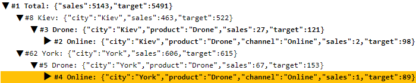

# Tutorial

## Create an insight tree from data

Download [sales-data.csv](../app/sales-data.csv ":ignore").

Create an `index.html` with an empty `<div>` element:

```html
<meta charset="utf-8" />
<link rel="stylesheet" href="../insighttree.css" />
<div class="sales-tree"></div>

<script type="module"></script>
```

Inside the `<script type="module">`, load [sales-data.csv](sales-data.csv ":ignore").:

```js
import { csvParse } from "https://cdn.skypack.dev/d3-dsv@3";
const response = await fetch("sales-data.csv");
const data = csvParse(await response.text())
```

Let's find where the `sales` was below `target` -- drilling down by `city`, `product`, and `channel`:

```js
import { insightTree } from "../index.js";

const tree = insightTree({
  selector: ".sales-tree",
  data: data,
  // Group the data by city, then product, then channel
  groups: ["city", "product", "channel"],
  // Calculate the total of sales and target
  metrics: ["sales", "target"],
  // Rank insights by where the sales missed the target the most
  rankBy: ({ sales, target }) => sales - target,
});
// Show only top 4 insights
tree.update({ rank: 4 });
```

[Read the API documentation](api.md) to understand the options in detail.

This renders the following output:

[Tutorial - 1](sales-tutorial-1.html ":include :type=html height=200px")



This tree:

- **Ranks the gaps**. `#1` is where sales was most below target, followed by `#2`, etc.
- **Focuses on insights**. It shows only the 4 biggest gaps (and its parents), hiding the rest
- **Lets you explore**. Click any row to expand or collapse it

## Add a slider to control insights

Add a slider above the `<div class="insight tree">`:

```html
<input class="slider" type="range" min="1" max="12" value="4" />
```

When the slider changes, update the insights inside the `<script type="module">`:

```js
document.querySelector(".slider").addEventListener("input", (e) => {
  tree.update({ rank: e.target.value });
});
```

[Tutorial - 2](sales-tutorial-2.html ":include :type=html height=200px")


This tree:

- **Controls the number of insights**. Increasing the slider shows more gaps. Decreasing shows fewer gaps.
- **Highlights the current gap**. The row in orange is the current insight.

## Style the tree

[`insightTree()`](api.md) adds classes and attributes to each row. A may have these classes:

- `.insight-current` on current ranked insight. Default style: `background-color: ##ffc107`. Set to `background-color: gold` to color it gold.
- `.insight-highlight` on higher ranked insights. Default style: `font-weight: bold`. Set to `font-weight: normal; color: red` to color it red.
- `.insight-hidden` on lower ranked insights. Default style: `display: none`. Set to `display: block; color: lightgrey` to show them in gray.
- `.insight-closed` on closed insights. Any child `.insight-toggle` is styled as
  - `.insight-toggle:before { content: "▶"; }` when open
  - This is rotated 90 degrees clockwise when closed (like ▼)

A row always has these attributes:

- `[data-insight-level]`: level of indentation. Default style: `cursor: pointer`
- `[data-insight-rank]`: rank of the insight. `1` is the highest ranked insight. No default style.

Note: You can rename the "Total" group to "All" by passing `insightTree({ ..., totalGroup: "All" })`.

Download [arrow.svg](arrow.svg ":ignore") to the same folder and add this below `<link rel="stylesheet" ...>`:

```html
<style>
  .insight-current {
    background-color: yellow;
  }
  .insight-highlight {
    color: red;
  }
  .insight-toggle:before {
    content: url("arrow.svg");
  }
</style>
```

[Tutorial - 3](sales-tutorial-3.html ":include :type=html height=200px")


## Render custom trees

[`insightTree()`](api.md) accepts a `render(el, tree)` function. This can be used to render the tree in any way.

For example, to render the tree as a table, add this just after `rankBy: ...`

```js
    render: (el, tree) => el.innerHTML = /* html */ `
      <table>
        <thead><tr><th>#</th><th>Group</th><th>Gap</th><th>Sales</th><th>Target</th></tr></thead>
        <tbody>
          ${tree.map(({ _level, _rank, _group, sales, target }) => /* html */ `
            <tr data-insight-level="${_level}" data-insight-rank="${_rank}">
              <td class="text-end">#${_rank}</th>
              <td style="padding-left:${_level * 1.5}rem">
                <span class="insight-toggle"></span> ${_group}
              </td>
              <td class="text-end">${sales - target}</td>
              <td class="text-end">${sales}</td>
              <td class="text-end">${target}</td>
            </tr>`).join("")}
        </tbody>
      </table>`,
```

[Tutorial - 4](sales-tutorial-4.html ":include :type=html height=250px")


The `render()` function is passed the element `el` and tree `tree`. The tree is an array of objects:

```js
[
  { _level: 0, _rank: 1, _group: "Total", sales: 5143, target: 5491 },
  { _level: 1, _rank: 23, _group: "Aden", city: "Aden", sales: 625, target: 653 },
  {
    _level: 2,
    _rank: 18,
    _group: "Clock",
    city: "Aden",
    product: "Clock",
    sales: 127,
    target: 159,
  },
  // ...
];
```

- `_level`: level of indentation
- `_rank`: rank of the insight. `1` is the highest ranked insight.
- `_group`: current group value. For `_level == 1`, this is the `city`, for `_level == 2`, this is the `product`, etc.
- All other groups keys, i.e.
  - `city` (if `_level >= 1`),
  - `product` (if `_level >= 2`)
  - `channel` (if `_level >= 3`)
- All metrics, i.e.
  - `sales`
  - `target`

**REMEMBER**:

- You MUST add `data-insight-level="${_level}` to each row
- You MUST add `data-insight-rank=${_rank}"` to each row
- Indent based on `_level`
- Add a `<span class="insight-toggle"></span>` inside the row to show the expand/collapse icon

## Integrating with other libraries

When rendering the tree, you can use any JavaScript function, including from libraries like d3 or Bootstrap.

For example, add Bootstrap to at the start of your HTML:

```html
<link rel="stylesheet" href="https://cdn.jsdelivr.net/npm/bootstrap@5/dist/css/bootstrap.min.css" />
```

At the start of the `<script type="module">`, add a D3 color scale:

```js
import { scaleLinear } from "https://cdn.skypack.dev/d3-scale@4";
const color = scaleLinear().domain([0.5, 1, 1.2]).range(["red", "yellow", "lime"]);
```

Now, in the `render()` function, replace `<table>` with `<table class="table w-auto">` to style the table with Bootstrap.

Also replace:

```html
<td class="text-end">${sales - target}</td>
```

... with a cell that is colored based on the sales/target ratio:

```html
<td class="text-end" style="background-color:${color(sales / target)};color:black">
  ${sales - target}
</td>
```

[Tutorial - 5](sales-tutorial-5.html ":include :type=html height=350px")


## Custom aggregation

`groups`, `metrics` and `sort` can be used to flexibly aggregate the data.

Given this data:

| a   | b   | x   | y   | z   |
| --- | --- | --- | --- | --- |
| a1  | b1  | 1   | 2   | 3   |
| a1  | b2  | 4   | 5   | 6   |
| a1  | b3  | 7   | 8   | 9   |
| a2  | b1  | 10  | 11  | 12  |
| a2  | b2  | 13  | 14  | 15  |
| a2  | b3  | 16  | 17  | 18  |

GROUP BY: `a`. CALCULATE: SUM(x), SUM(y), and SUM(z):

```js
  groups: ["a"],
  metrics: ["x", "y", "z"],
```

| \_level | \_group | a   | x   | y   | z   |
| ------- | ------- | --- | --- | --- | --- |
| 0       |         |     | 51  | 57  | 63  |
| 1       | a1      | a1  | 12  | 15  | 18  |
| 1       | a2      | a2  | 39  | 42  | 45  |

GROUP BY: `a`, last letter of `b`. CALCULATE: SUM(x):

```js
  groups: { a: "a", b: (row) => row.b.slice(-1) },
  metrics: ["x"],
```

| \_level | \_group | a   | b   | x   |
| ------- | ------- | --- | --- | --- |
| 0       |         |     |     | 51  |
| 1       | a1      | a1  |     | 12  |
| 2       | 1       | a1  | 1   | 1   |
| 2       | 2       | a1  | 2   | 4   |
| 2       | 3       | a1  | 3   | 7   |
| 1       | a2      | a2  |     | 39  |
| 2       | 1       | a2  | 1   | 10  |
| 2       | 2       | a2  | 2   | 13  |
| 2       | 3       | a2  | 3   | 16  |

GROUP BY: `a`. CALCULATE: SUM(x), AVG(y), the first value of z, and x - y:

```js
  groups: ["a"],
  metrics: {
    x: "sum",
    y: "avg",
    z: (data) => data[0].z,
    diff: (data, result) => result.x - result.y,
  },
```

| \_level | a   | x   | y   | z   | diff |
| ------- | --- | --- | --- | --- | ---- |
| 0       |     | 51  | 9.5 | 6   | 41.5 |
| 1       | a1  | 12  | 5   | 3   | 7    |
| 1       | a2  | 39  | 14  | 3   | 25   |

GROUP BY: `a`, `b`. CALCULATE: SUM(x). SORT BY: `x` descending:

```js
  groups: ["a", "b"],
  metrics: ["x"],
  sort: "-x",
```

| \_level | a   | b   | x   |
| ------- | --- | --- | --- |
| 0       |     |     | 51  |
| 1       | a2  |     | 39  |
| 2       | a2  | b3  | 16  |
| 2       | a2  | b2  | 13  |
| 2       | a2  | b1  | 10  |
| 1       | a1  |     | 12  |
| 2       | a1  | b3  | 7   |
| 2       | a1  | b2  | 4   |
| 2       | a1  | b1  | 1   |

GROUPS `a`, `b`. SUBTOTAL: SUM(x). SORT BY: `a` by `x` asc, `b` by the last letter `b` asc:

```js
  groups: ["a", "b"],
  metrics: ["x"],
  sort: { a: "+x", b: (m, n) => (m.b.slice(-1) < n.b.slice(-1) ? -1 : 1) },
```

| \_level | a   | b   | x   |
| ------- | --- | --- | --- |
| 0       |     |     | 51  |
| 1       | a1  |     | 12  |
| 2       | a1  | b1  | 1   |
| 2       | a1  | b2  | 4   |
| 2       | a1  | b3  | 7   |
| 1       | a2  |     | 39  |
| 2       | a2  | b1  | 10  |
| 2       | a2  | b2  | 13  |
| 2       | a2  | b3  | 16  |
